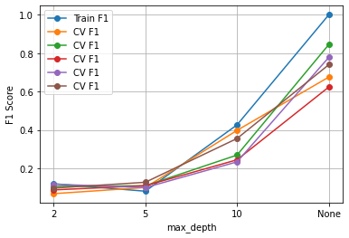
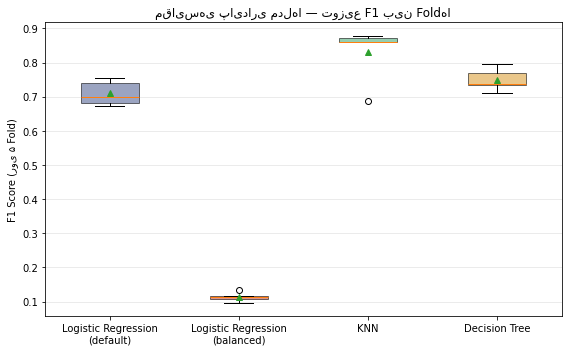
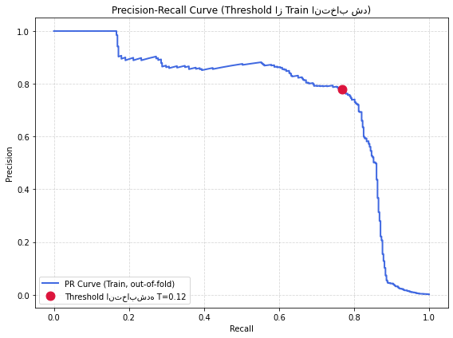

# گزارش آزمایش‌ها — تشخیص تقلب کارت اعتباری

## چکیده

دیتاست به‌شدت نامتوازن است (۰.۱۷٪ تقلب). سه مدل (Logistic Regression، KNN، Decision Tree) با سه آزمایش کنترل‌شده (Scaling، عمق درخت، Threshold) مقایسه شدند. **مدل نهایی: Logistic Regression + Threshold=۰.۱۱۶۸**، با Precision=۰.۸۳۳ و Recall=۰.۷۳۷ روی Test.

---

## ۱. مقدمه

چالش اصلی، عدم توازن شدید کلاس‌هاست که Accuracy را بی‌فایده می‌کند. هدف: مقایسه‌ی مدل‌ها، بررسی اثر Scaling و Hyperparameter، و تنظیم اصولی Trade-off بین Precision/Recall با Threshold Tuning (به‌جای `class_weight`).

---

## ۲. داده

۲۸۴٬۸۰۷ تراکنش، ۳۱ ستون (`Time`, `V1`...`V28` خروجی PCA، `Amount`, `Class`).

| کلاس | تعداد | درصد |
|---|---:|---:|
| ۰ (سالم) | ۲۸۴٬۳۱۵ | ۹۹.۸۳٪ |
| ۱ (تقلبی) | ۴۹۲ | ۰.۱۷٪ |

- Missing values: صفر.
- Duplicate rows: ۱۰۸۱ — از این‌ها ۳۲ مورد تقلبی بودند (نرخ تقلب در تکراری‌ها ۱۰ برابر کل داده)، پس حذف آن‌ها باید با احتیاط و **قبل از Split** انجام شود.
- مقیاس فیچرها ناهمگون: `std(V1)≈2` در برابر `std(Amount)≈250`.

---

## ۳. پیش‌پردازش

1. **حذف Duplicate قبل از Split** (وگرنه نمونه‌ی تکراری هم در Train هم در Test می‌افتد → Leakage). نتیجه: (۲۸۳٬۷۲۶, ۳۱)، ۴۷۳ تقلب.
2. **Split:** `train_test_split(test_size=0.2, stratify=y, random_state=42)`. توزیع کلاس در Train/Test تقریباً یکسان ماند (۰.۱۶۶۵٪ / ۰.۱۶۷۴٪). هم‌پوشانی Train-Test: صفر.
3. **Scaling:** `StandardScaler` روی هر ۳۰ فیچر، همیشه **درون Pipeline** (فیت فقط روی Train هر Fold) تا نشتی از Test/Validation جلوگیری شود.

---

## ۴. مدل‌های پایه

هر مدل با ۵-Fold Stratified CV روی Train و یک ارزیابی نهایی روی Test سنجیده شد.

### ۴.۱ Logistic Regression

$\sigma(z)=\frac{1}{1+e^{-z}}$, کمینه‌سازی Log-Loss.

| | Precision | Recall | F1 | Accuracy |
|---|---:|---:|---:|---:|
| CV (میانگین) | ۰.۸۶۳ | ۰.۶۰۶ | ۰.۷۱۰ | ۰.۹۹۹۲ |
| Test | ۰.۸۴۶ | ۰.۵۷۹ | ۰.۶۸۸ | ۰.۹۹۹۱ |

| | پیش‌بینی سالم | پیش‌بینی تقلبی |
|---|---:|---:|
| **واقعی سالم** | ۵۶۶۴۱ | ۱۰ |
| **واقعی تقلبی** | ۴۰ | ۵۵ |

**با `class_weight='balanced'`:** Precision=۰.۰۶۱, Recall=۰.۹۱۸ (CV). به ازای هر تقلب اضافه، ~۴۹ مشتری سالم اشتباهاً متهم شدند — ابزار خیلی خشن.

| | پیش‌بینی سالم | پیش‌بینی تقلبی |
|---|---:|---:|
| **واقعی سالم** | ۵۵۲۶۲ | ۱۳۸۹ |
| **واقعی تقلبی** | ۱۲ | ۸۳ |

### ۴.۲ KNN (k=5)

فاصله‌ی اقلیدسی؛ رأی اکثریت $k$ همسایه.

| | Precision | Recall | F1 | Accuracy |
|---|---:|---:|---:|---:|
| CV (میانگین) | ۰.۹۱۶ | ۰.۷۶۵ | ۰.۸۳۲ | ۰.۹۹۹۵ |
| Test | ۰.۹۵۶ | ۰.۶۸۴ | ۰.۷۹۸ | ۰.۹۹۹۴ |

| | پیش‌بینی سالم | پیش‌بینی تقلبی |
|---|---:|---:|
| **واقعی سالم** | ۵۶۶۴۸ | ۳ |
| **واقعی تقلبی** | ۳۰ | ۶۵ |

بهترین میانگین F1، ولی یک Fold ضعیف داشت (بخش ۷).

### ۴.۳ Decision Tree

معیار Split: Gini Impurity $=1-\sum p_i^2$.

| | Precision | Recall | F1 | Accuracy |
|---|---:|---:|---:|---:|
| CV (میانگین) | ۰.۷۵۸ | ۰.۷۴۳ | ۰.۷۵۰ | ۰.۹۹۹۲ |
| Test | ۰.۷۲۰ | ۰.۷۰۵ | ۰.۷۱۳ | ۰.۹۹۹۰ |

| | پیش‌بینی سالم | پیش‌بینی تقلبی |
|---|---:|---:|
| **واقعی سالم** | ۵۶۶۲۵ | ۲۶ |
| **واقعی تقلبی** | ۲۸ | ۶۷ |

**Overfitting:** با `max_depth=None`، train_f1=۱.۰۰۰ (برگ‌های کاملاً خالص) در برابر CV=۰.۷۵۰. عمق واقعی: **۳۳**.

---

## ۵. آزمایش ۱: اثر Scaling روی KNN

نسبت $(std(Amount)/std(V1))^2\approx16000$ پیش‌بینی می‌کرد Scaling حیاتی باشد:

| حالت | Precision | Recall | F1 |
|---|---:|---:|---:|
| بدون Scaling | ۰.۸۰۰ | ۰.۰۱۳ | ۰.۰۲۶ |
| با Scaling | ۰.۹۱۶ | ۰.۷۶۵ | ۰.۸۳۲ |

بدون Scaling، فاصله عملاً فقط با `Amount` تعیین می‌شد؛ چون تقلب روی `Amount` پراکنده است، همسایه‌ها تقریباً هیچ‌وقت هم‌کلاس نبودند. Decision Tree (Split تک‌فیچری، فقط وابسته به ترتیب مقادیر) به این مسئله حساس نیست.

---

## ۶. آزمایش ۲: اثر `max_depth`

با `class_weight='balanced'`:

| max_depth | Train F1 | CV Precision | CV Recall | CV F1 |
|---:|---:|---:|---:|---:|
| ۲ | ۰.۱۲۱ | ۰.۰۵۱ | ۰.۸۷۶ | ۰.۰۹۶ |
| ۵ | ۰.۰۸۲ | ۰.۰۵۹ | ۰.۸۵۲ | ۰.۱۱۰ |
| ۱۰ | ۰.۴۲۷ | ۰.۱۸۸ | ۰.۸۰۲ | ۰.۳۰۱ |
| None (۳۳) | ۱.۰۰۰ | ۰.۷۶۰ | ۰.۷۰۹ | ۰.۷۳۳ |

درخت‌های کم‌عمق + `balanced` = همان الگوی Precision فاجعه‌بار. نکته: حتی در عمق نامحدود، `balanced` بهتر از حالت بدون وزن‌دهی نشد (۰.۷۳۳ در برابر ۰.۷۵۰).



---

## ۷. پایداری مدل‌ها



- **LR (balanced):** پایدارترین (باریک‌ترین جعبه)، ولی میانه‌ی پایین — «پایدار ولی بد».
- **KNN:** بالاترین میانه (~۰.۸۶)، ولی یک Outlier شدید (Recall≈۰.۵۹۲ در یک Fold) — ریسک بی‌ثباتی.
- **Decision Tree:** میانه‌ی متوسط (~۰.۷۵)، بدون Outlier، کف بالاتر از LR پیش‌فرض.

---

## ۸. آزمایش ۳: تحلیل Threshold

Threshold=۰.۵ یک قرارداد است، نه قانون. برخلاف `class_weight`، Threshold Tuning بعد از Training روی احتمالات اعمال می‌شود — کل طیف Trade-off بدون Retrain قابل بررسی است.

**چرا نه Decision Tree؟** با `max_depth=None`، `predict_proba` فقط ۰ یا ۱ برمی‌گرداند (برگ‌های کاملاً خالص) — هر Threshold بین ۰.۱ تا ۰.۹ نتیجه‌ی یکسان داد (P=۰.۷۲۰, R=۰.۷۰۵ ثابت). این فاز روی **Logistic Regression** انجام شد.

**اشتباه اول:** انتخاب Threshold مستقیم از `precision_recall_curve` روی Test = Leakage (انتخاب Hyperparameter از روی داده‌ی ارزیابی نهایی).

**اصلاح:** با `cross_val_predict` روی Train (out-of-fold)، منحنی PR فقط از Train ساخته شد:



- Threshold انتخاب‌شده (از Train): **۰.۱۱۶۸**
- F1 روی Train-CV: ۰.۷۷۳۳ → F1 نهایی روی Test: **۰.۷۸۲۱** (فاصله‌ی کم = انتخاب پایدار، نه Overfit)

**چرا منحنی دندانه‌دار است؟** Recall با کاهش Threshold یکنواخت بالا می‌رود، ولی Precision نه — چون نمونه‌های تازه‌اضافه‌شده به «مثبت» ترکیبی از TP/FP هستند.

**چرا سقوط تند در Recall بالا؟** در Threshold‌های خیلی پایین، ناحیه‌ی کم‌اطمینان عمدتاً از نمونه‌های سالم (نه تقلب نادر) پر شده — FP انبوه می‌شود، Recall فقط کمی بهتر می‌شود.

**Confusion Matrix نهایی (Threshold=۰.۱۱۶۸):**

| | پیش‌بینی سالم | پیش‌بینی تقلبی |
|---|---:|---:|
| **واقعی سالم** | ۵۶۶۳۷ | ۱۴ |
| **واقعی تقلبی** | ۲۵ | ۷۰ |

---

## ۹. نتایج کلی و مقایسه

| مدل | Precision | Recall | F1 | نکته |
|---|---:|---:|---:|---|
| LR (پیش‌فرض) | ۰.۸۶۳ | ۰.۶۰۶ | ۰.۷۱۰ | پایه‌ی محافظه‌کار |
| LR (balanced) | ۰.۰۶۱ | ۰.۹۱۸ | ۰.۱۱۳ | Precision فاجعه‌بار |
| KNN | ۰.۹۱۶ | ۰.۷۶۵ | **۰.۸۳۲** | بهترین میانگین، Outlier خطرناک |
| Decision Tree | ۰.۷۵۸ | ۰.۷۴۳ | ۰.۷۵۰ | پایدارترین، بدون Outlier |

**سرعت Prediction:** KNN باید فاصله تا ۲۲۷٬۸۴۵ نمونه حساب کند ($O(n{\cdot}d)$)؛ Decision Tree فقط ۳۳ مقایسه ($O(\text{depth})$) — تفاوت مرتبه‌بزرگی برای سیستم Real-time.

**چرخش تصمیم نهایی:** تحلیل اولیه Decision Tree را (پایداری+سرعت) ترجیح می‌داد. اما چون برگ‌های خالص آن `predict_proba` را دودویی می‌کنند، برای Threshold Tuning غیرقابل‌استفاده بود. چون کنترل ظریف Trade-off برای این مسئله ارزشمند است، **مدل نهایی: Logistic Regression + Threshold=۰.۱۱۶۸**.

---

## ۱۰. تفسیر کسب‌وکاری

- **هزینه‌ی FN** (تقلب از‌دست‌رفته) > **هزینه‌ی FP** (هشدار اشتباه) — اما نه به قیمت فروپاشی Precision (نمونه: `balanced` با ۴۹ مشتری سالم قربانی به ازای هر تقلب اضافه، غیرقابل‌قبول است).
- با مدل نهایی: از هر ۱۰۰ تقلب واقعی، ۷۴ مورد کشف می‌شود؛ از هر ۱۰۰ هشدار، ۸۳ مورد درست است (۱ اشتباه به ازای هر ۶ هشدار).
- **توصیه:** تراکنش‌های پرچم‌خورده به بررسی انسانی/احراز هویت اضافه بروند، نه مسدودسازی خودکار.
- **عملیاتی:** Threshold بدون Retrain، فقط با تغییر `model_config.json` قابل تنظیم است؛ به‌دلیل Concept Drift، پایش و بازآموزی دوره‌ای لازم است.

---

## ۱۱. جمع‌بندی

**مدل مستقر:** Logistic Regression + StandardScaler + Threshold=۰.۱۱۶۸، آموزش‌دیده روی کل داده‌ی تمیز (۲۸۳٬۷۲۶ ردیف).

**نتیجه‌ی نهایی روی Test:** Precision=۰.۸۳۳, Recall=۰.۷۳۷, F1=۰.۷۸۲۱.

```
models/
├── model.pkl
├── scaler.pkl
└── model_config.json   # {"threshold": 0.1168}
```

**درس‌های کلیدی:**
1. با داده‌ی نامتوازن، Accuracy گمراه‌کننده است.
2. Scaling برای مدل‌های مبتنی بر فاصله حیاتی، برای Decision Tree بی‌اثر است.
3. Threshold Tuning کنترل ظریف‌تری از `class_weight` می‌دهد — به‌شرط خروجی احتمالی پیوسته.
4. انتخاب هر Hyperparameter (حتی Threshold) فقط از Train، وگرنه Leakage.
5. میانگین کافی نیست؛ پایداری بین Fold‌ها هم باید سنجیده شود.

**محدودیت‌ها:** بازه‌ی depth بین ۱۰ و ۳۳ کاوش نشد؛ مدل نیاز به بازآموزی دوره‌ای برای Concept Drift دارد.
